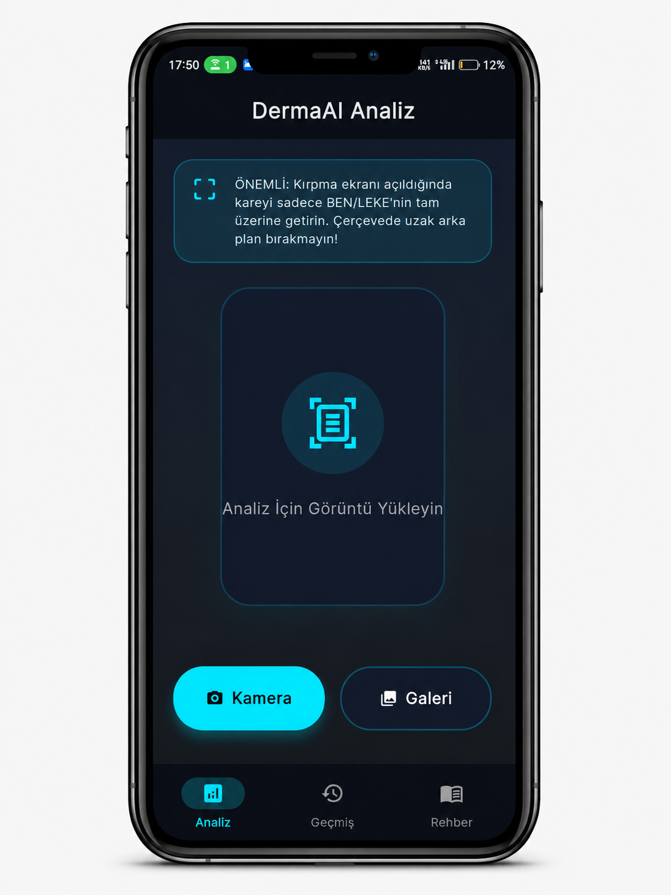
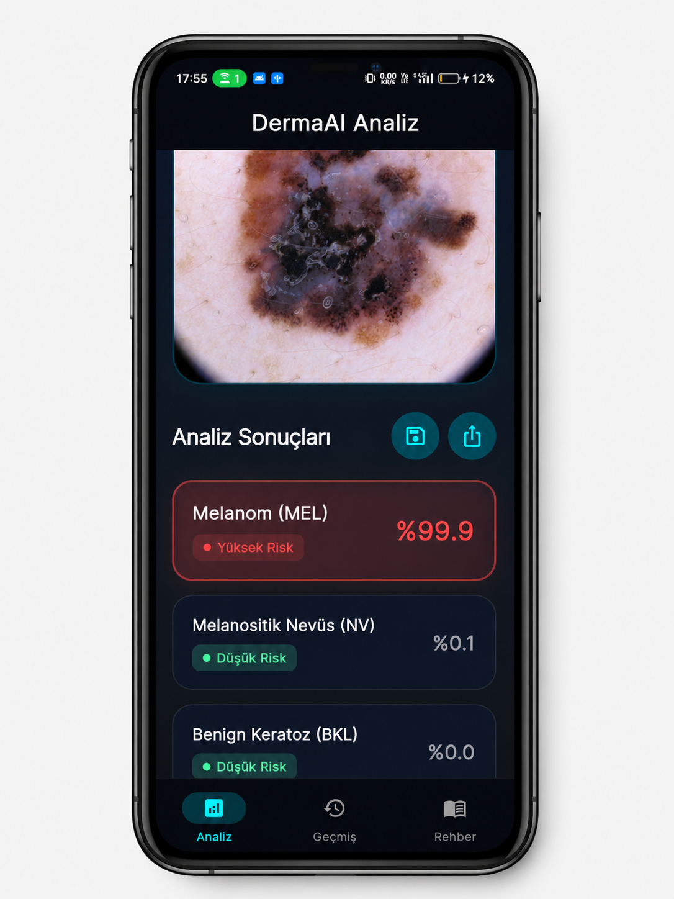
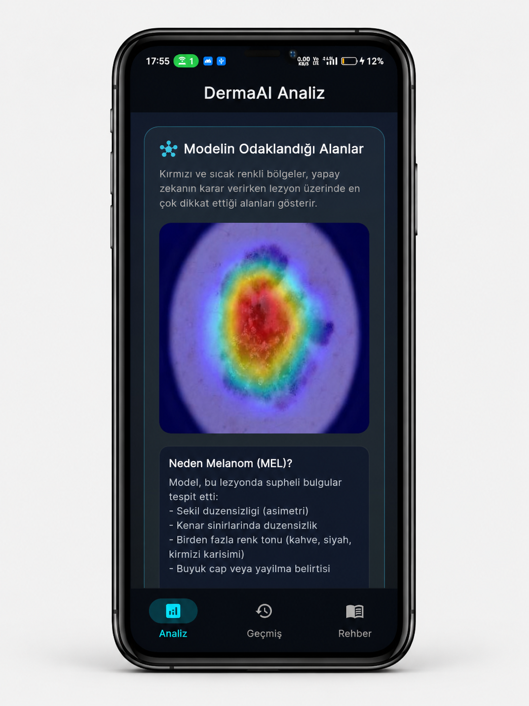
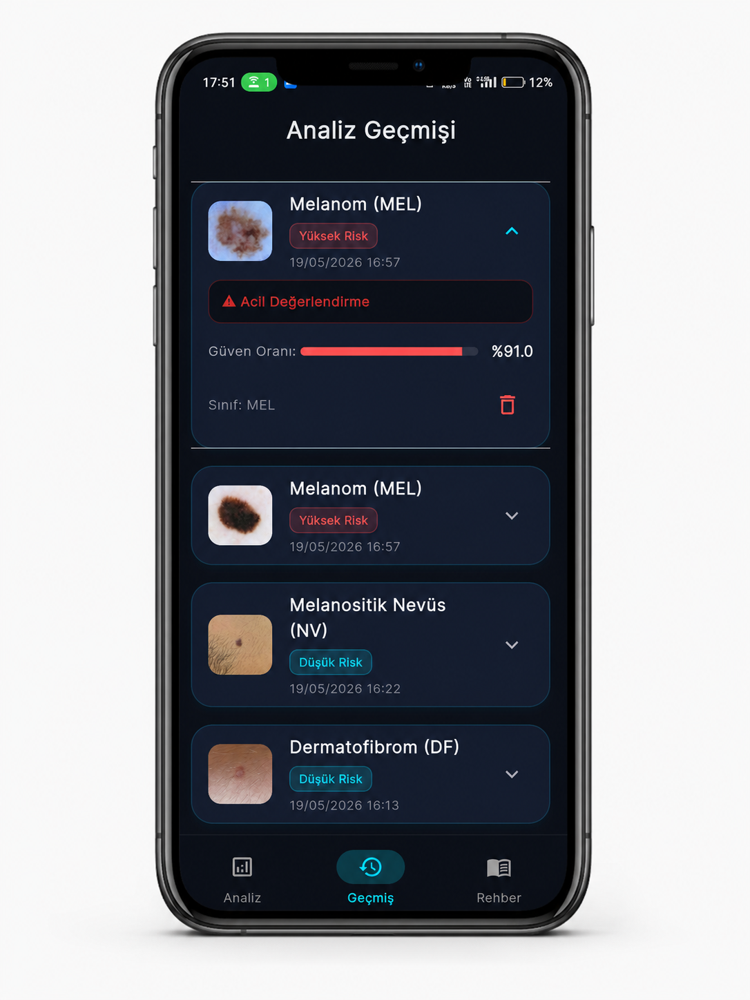
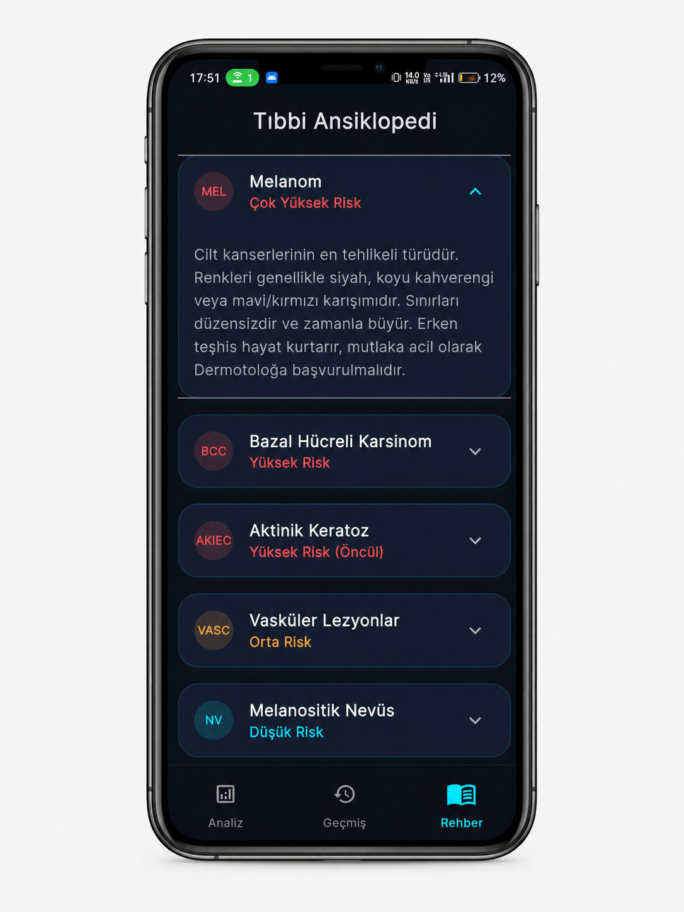

# Derma AI

> Two-stage deep learning pipeline for skin lesion detection and seven-class classification, integrated with a Flutter application and Grad-CAM explainability.

## Overview

**Derma AI** is an end-to-end computer vision project for skin lesion image analysis. The system uses two separate deep learning models in sequence:

1. **Lesion Detection** — a MobileNetV3-Small binary classifier determines whether an image contains a lesion.
2. **Lesion Classification** — an EfficientNet-B2 classifier assigns detected lesions to one of seven HAM10000 categories.
3. **Explainability** — Grad-CAM provides a visual interpretation of regions contributing to the classification prediction.

The machine learning pipeline is implemented with **Python, PyTorch and Torchvision**. The application layer is implemented with **Flutter and Dart**.

> **Medical disclaimer:** This project is for educational and research purposes only. It is not a medical diagnostic device and must not be used as a substitute for evaluation by a qualified healthcare professional.

---

## Application Preview

The Derma AI application provides a complete workflow from image analysis to explainability, analysis history, and educational medical information.

### Home Screen

The main application screen where users can start a new skin lesion analysis.



### Analysis Result

Displays the result produced by the analysis pipeline after processing an image.



### Grad-CAM Explainability

Grad-CAM provides a visual interpretation of the image regions that contributed to the classification prediction.



### Analysis History

Users can review previous analysis results through the application's analysis history.



### Medical Guide

The application includes an educational medical guide with information about skin conditions covered by the system.



---

## System Architecture

```text
                         Input Image
                              │
                              ▼
                 ┌─────────────────────────┐
                 │   Stage 1: Detection    │
                 │    MobileNetV3-Small    │
                 │     Binary Classifier   │
                 └────────────┬────────────┘
                              │
                    ┌─────────┴─────────┐
                    │                   │
             Lesion Detected       No Lesion
                    │                   │
                    ▼                   ▼
          ┌──────────────────┐       Result
          │ Stage 2:         │
          │ Classification   │
          │ EfficientNet-B2  │
          │ 7 Classes        │
          └────────┬─────────┘
                   │
                   ▼
            Predicted Class
                   │
                   ▼
             Grad-CAM Map
```

---

## Models

### Stage 1 — Lesion Detection

**Architecture:** MobileNetV3-Small

**Task:** Binary classification

| Label | Meaning |
|---|---|
| `0` | `lezyon_degil` |
| `1` | `lezyon` |

The training pipeline uses ImageNet-pretrained weights, weighted sampling, augmentation, two-stage fine-tuning, AUC-based checkpoint selection and validation-based threshold optimization.

Training source:

```text
training/lesion_detection/train.py
```

### Stage 2 — Lesion Classification

**Architecture:** EfficientNet-B2

**Task:** Seven-class classification

The model uses ImageNet-pretrained weights and a leakage-aware split based on `lesion_id` from HAM10000.

Training source:

```text
training/lesion_classification/train.py
```

---

## HAM10000 Classes

| Code | Description |
|---|---|
| `AKIEC` | Actinic keratoses / intraepithelial carcinoma |
| `BCC` | Basal cell carcinoma |
| `BKL` | Benign keratosis-like lesions |
| `DF` | Dermatofibroma |
| `MEL` | Melanoma |
| `NV` | Melanocytic nevi |
| `VASC` | Vascular lesions |

---

## Training Pipeline

### Detection Model

- MobileNetV3-Small
- ImageNet transfer learning
- Binary `BCEWithLogitsLoss`
- WeightedRandomSampler
- Lesion-specific low-quality augmentation
- Gaussian noise augmentation
- Stage 1 classifier training
- Stage 2 fine-tuning
- Validation AUC model selection
- F1-based threshold optimization
- PyTorch checkpoint export
- TorchScript export

### Classification Model

- EfficientNet-B2
- ImageNet transfer learning
- `GroupShuffleSplit` using `lesion_id`
- WeightedRandomSampler
- Random crop, rotation and flip augmentation
- Controlled color augmentation
- Cross-entropy loss
- AdamW optimizer
- Cosine Annealing Warm Restarts
- Macro F1 evaluation
- Early stopping
- Best-model checkpointing

---

## Repository Structure

```text
Derma-AI/
│
├── screenshots/
│   ├── home.png
│   ├── analysis_result.png
│   ├── gradcam.png
│   ├── analysis_history.png
│   └── medical_guide.png
│
├── training/
│   ├── lesion_detection/
│   │   └── train.py
│   │
│   └── lesion_classification/
│       └── train.py
│
├── flutter_application_HAM10000/
│   ├── lib/                  # Flutter application source
│   ├── assets/               # Application assets
│   ├── gradcam_api.py        # Grad-CAM API
│   ├── android/              # Android platform files
│   ├── ios/                  # iOS platform files
│   ├── linux/                # Linux platform files
│   ├── macos/                # macOS platform files
│   ├── pubspec.yaml          # Flutter configuration
│   └── test/                 # Flutter tests
│
├── convert_model.py          # Model conversion utility
├── inspect_model.py          # Model inspection utility
├── test_arch.py              # Architecture testing utility
├── requirements.txt          # Python dependencies
├── .gitignore
└── README.md
```

---

## Dataset

The seven-class classification model uses the **HAM10000** dataset.

The lesion detection model uses HAM10000 images as positive examples together with additional non-lesion image datasets as negative examples during training.

Datasets are **not included** in this repository. Training scripts use configurable dataset roots instead of machine-specific absolute paths.

### Classification dataset layout

The classification training script expects a structure similar to:

```text
ham10000/
├── HAM10000_metadata.csv
└── images_all/
    ├── image_001.jpg
    ├── image_002.jpg
    └── ...
```

The root can be configured with:

```text
DERMA_HAM10000_ROOT
```

### Detection dataset layout

The detection training script can use the Kaggle-style dataset structure defined in its configuration. The root can be configured with:

```text
DERMA_DATASET_DIR
```

Output paths can be configured with:

```text
DERMA_OUTPUT_DIR
```

This keeps the training code portable across Kaggle, local machines and other environments without exposing personal Windows paths.

---

## Installation

### Python

Create a virtual environment:

```bash
python -m venv .venv
```

Windows:

```bash
.venv\Scripts\activate
```

Linux/macOS:

```bash
source .venv/bin/activate
```

Install dependencies:

```bash
pip install -r requirements.txt
```

### Flutter

```bash
cd flutter_application_HAM10000
flutter pub get
flutter run
```

The exact runtime configuration depends on the available model artifacts and API configuration.

---

## Training

### Train lesion detection model

```bash
python training/lesion_detection/train.py
```

### Train seven-class classification model

```bash
python training/lesion_classification/train.py
```

Model weights and generated artifacts are intentionally excluded from source control when they are too large for normal GitHub repository usage.

---

## Explainability

The project includes a Grad-CAM component for visual model interpretation.

```text
flutter_application_HAM10000/gradcam_api.py
```

Grad-CAM highlights image regions that contribute to the classification model's prediction. It is intended as an interpretability aid and should not be interpreted as a clinical explanation or diagnostic evidence.

---

## Technology Stack

**Machine Learning**

- Python
- PyTorch
- Torchvision
- EfficientNet-B2
- MobileNetV3-Small
- Grad-CAM
- OpenCV
- NumPy
- Pandas
- scikit-learn
- Pillow

**Application**

- Flutter
- Dart

**Dataset**

- HAM10000

---

## Limitations

- Predictions are not medical diagnoses.
- Dataset-specific performance does not guarantee real-world clinical performance.
- Image quality and acquisition conditions can affect predictions.
- Dataset imbalance and domain shift may affect generalization.
- Grad-CAM visualizations do not establish causality or clinical validity.
- Large datasets and model binaries are not stored in the repository.

---

## Project Purpose

Derma AI demonstrates an end-to-end medical computer vision workflow combining:

- Deep learning
- Transfer learning
- Binary image classification
- Multi-class image classification
- Dataset balancing
- Leakage-aware validation
- Model evaluation
- Explainable AI
- Mobile application development

The project is structured to show how trained computer vision models can be integrated into an application-oriented pipeline.

---

## Disclaimer

**Derma AI is an educational and research project. It is not intended for clinical use, medical diagnosis, treatment decisions, or emergency decision-making. Always consult a qualified healthcare professional for medical evaluation.**

---

## Author

**Musa Talha Öz**

Computer Engineering

GitHub: [@Mtalhaz](https://github.com/Mtalhaz)
